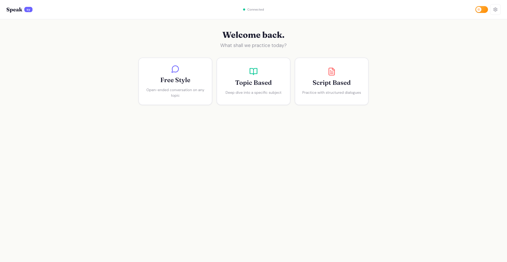
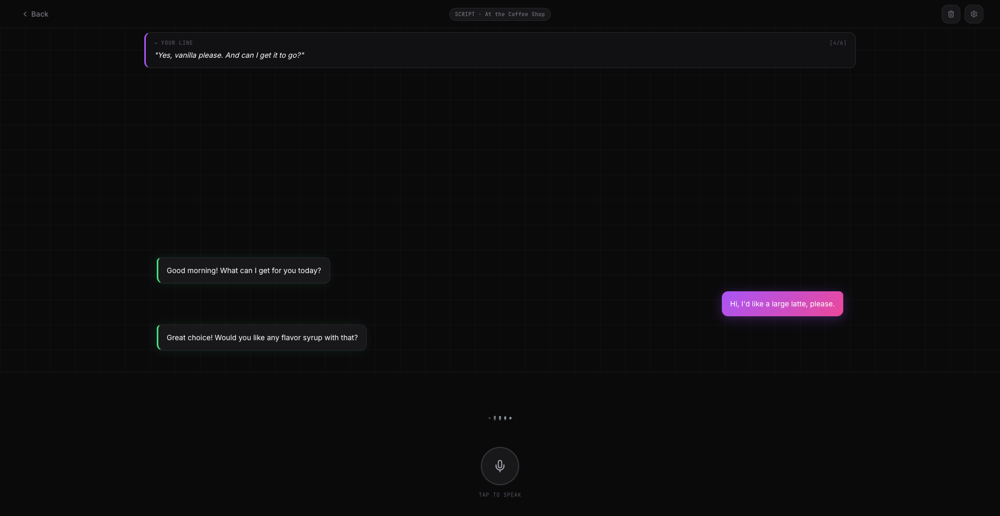

# Speaksy

A local-first, open-source speaking practice app. Practice fluency by talking to an AI partner with your microphone and hearing spoken responses back.

## Screenshots




## Quick Start with Docker

```bash
# Pull and run the app
docker pull nuvocode/speaksy:latest
docker run -d \
  --name speaksy \
  -p 3000:3000 \
  --env-file .env \
  nuvocode/speaksy:latest
```

Or with Docker Compose:

```bash
docker compose up -d
```

Open [http://localhost:3000](http://localhost:3000)

## Provider Configuration

Create a `.env` file to configure your AI provider:

```env
# Local - Ollama (recommended)
AI_PROVIDER=ollama
OLLAMA_MODEL=llama3.2

# Local - LM Studio
AI_PROVIDER=lmstudio
LMSTUDIO_MODEL=local-model

# Cloud - Gemini
AI_PROVIDER=gemini
GEMINI_API_KEY=your_key_here

# Cloud - OpenAI
AI_PROVIDER=openai
OPENAI_API_KEY=your_key_here

# Cloud - Anthropic
AI_PROVIDER=anthropic
ANTHROPIC_API_KEY=your_key_here

# Cloud - Groq
AI_PROVIDER=groq
GROQ_API_KEY=your_key_here
```

### Environment Variables

| Variable | Default | Description |
|---|---|---|
| `AI_PROVIDER` | `ollama` | Provider: ollama, lmstudio, gemini, openai, anthropic, groq |
| `OLLAMA_MODEL` | `llama3.2` | Ollama model name |
| `LMSTUDIO_MODEL` | `local-model` | LM Studio model identifier |
| `STT_PROVIDER` | `webspeech` | Browser STT or whisper |
| `KOKORO_URL` | `http://localhost:8880` | Kokoro TTS endpoint |
| `KOKORO_VOICE` | `af_heart` | Default voice |

## Local Providers Setup

### Ollama

```bash
# Install and pull a model
ollama pull llama3.2

# Start the service
ollama serve
```

### LM Studio

1. Download from [lmstudio.ai](https://lmstudio.ai)
2. Load a model and start the local server from the Developer tab

## Optional: Whisper STT

For server-side speech-to-text:

```bash
docker compose -f docker-compose.yml -f docker-compose.override.yml up -d
```

This sets `STT_PROVIDER=whisper`.

## Default Ports

| Service | Port |
|---|---|
| Frontend | 3000 |
| Backend | 3001 |
| Kokoro TTS | 8880 |
| Ollama | 11434 |
| LM Studio | 1234 |
| Whisper | 9000 |

## Features

- Voice-first speaking practice in the browser
- Local LLM support (Ollama, LM Studio)
- Cloud providers (Gemini, OpenAI, Anthropic, Groq)
- Text-to-speech via Kokoro
- Browser STT (default) or Whisper STT
- Practice modes: Freestyle, Topic, Script

## License

MIT
